# AI智能知识库管理系统
## 完整需求分析、项目计划与系统设计方案（PlantUML + Mermaid 可视化版）

> 本版本使用 **PlantUML** 提供规范 UML 用例图源码，其他流程、架构和数据图使用 **Mermaid**。  
> Mermaid 图可在 GitHub、Obsidian 或安装相应扩展的 VS Code 中预览；PlantUML 用例图需使用 PlantUML 扩展或渲染服务。

---

# 一、项目概述

## 1.1 项目名称

**AI智能知识库管理系统（AI Knowledge Base Management System，AI-KBMS）**

## 1.2 项目建设目标

系统围绕“用户管理、知识空间、文档管理、智能问答、数据统计”五大核心模块建设，形成：

**用户 → 文档 → 知识 → 检索 → AI → 答案 → 反馈 → 统计**

的完整知识管理闭环。

## 1.3 核心技术路线

- 前端：Vue 3 + TypeScript + Vite
- 后端：Spring Boot + Spring Security + MyBatis-Plus
- 数据库：MySQL
- 缓存：Redis
- 对象存储：MinIO
- AI 服务：Python + FastAPI
- 检索：Elasticsearch + 向量数据库
- 向量数据库：Milvus / pgvector
- AI：Embedding + Rerank + RAG + LLM
- 部署：Docker / Docker Compose + Nginx

---

# 二、业务场景理解

系统主要面向企业、学校、实验室、研发团队和组织内部知识管理场景。

典型业务流程：

1. 管理员创建系统用户并分配角色；
2. 知识管理员创建知识空间；
3. 管理员或编辑人员上传 PDF、Word、Markdown 等文档；
4. 系统自动完成文档解析、文本清洗、Chunk 切分和向量化；
5. 用户进入有权限的知识空间；
6. 用户以自然语言提出问题；
7. 系统从授权知识中进行混合检索；
8. Rerank 模块对召回内容重新排序；
9. LLM 根据检索结果生成回答；
10. 回答同步提供原始文档引用来源；
11. 系统记录问答、Token、用户反馈等统计数据。

---

# 三、系统角色

| 角色 | 主要职责 |
|---|---|
| 系统管理员 | 用户、角色、权限、配置、日志、模型和全局统计 |
| 知识管理员 | 创建知识空间、维护成员、管理文档 |
| 审核人员 | 审核知识内容、处理待审核文档 |
| 普通用户 | 知识检索、智能问答、查看引用与历史记录 |

---

# 四、功能需求

## 4.0 功能边界与通用规则

- 系统采用“系统级 RBAC + 知识空间级成员角色”两级权限模型。
- 所有核心业务数据进行逻辑删除；高风险操作写入审计日志。
- 列表类功能统一支持分页、关键字检索、状态筛选、排序和权限过滤。
- 文档解析、向量化和索引构建采用异步任务，支持状态查询、失败重试和幂等执行。
- 知识检索必须在召回前完成用户、空间、文档三级权限过滤。
- 模型回答应提供可追溯引用；当检索证据不足时拒绝无依据生成。

## 4.1 用户管理

- 用户登录/退出
- 用户新增、修改、删除
- 用户启用/禁用
- 修改密码、重置密码
- 角色管理
- 权限管理
- RBAC 权限分配
- 用户操作日志
- 账号锁定、登录失败限制和 Token 刷新/注销
- 用户分页查询、批量启停用和导入/导出
- 个人信息、头像和安全设置

## 4.2 知识空间

- 创建、编辑、删除知识空间
- 空间分类
- 空间标签
- 空间成员管理
- OWNER / ADMIN / EDITOR / READER 四级空间权限
- 空间文档统计
- 空间问答统计
- 公开、私有和指定成员可见性
- 成员邀请、移除、角色变更和所有权转移
- 空间归档与恢复，删除前进行关联数据检查

## 4.3 文档管理

- 单文件上传
- 批量上传
- PDF / DOCX / TXT / MD / PPTX / XLSX 等格式
- 文件预览
- 文件下载
- 文档更新
- 文档删除
- 文档解析
- 文本清洗
- Chunk 切分
- Embedding
- 向量入库
- 重新构建索引
- 文档版本记录
- 文档解析状态展示
- 文档标签、分类、关键字和元数据管理
- 文档审核、发布、驳回和下架
- 文档版本对比、历史版本查看与回滚
- 解析任务取消、失败原因查看和手动重试
- 文档重复检测、文件校验值和存储配额控制

## 4.4 智能问答

- 新建会话
- 连续多轮对话
- 指定知识空间问答
- 多知识空间联合问答
- 混合检索
- Rerank
- RAG
- SSE 流式输出
- 引用来源
- 历史对话
- 收藏
- 点赞/点踩
- 用户反馈
- 停止生成、重新生成和追问上下文管理
- 会话重命名、删除、导出和归档
- 引用片段预览、原文定位和相关度展示
- 敏感词、Prompt Injection 与输出合规检查
- 模型超时、限流、降级与失败重试

## 4.5 数据统计

- 用户总数
- 活跃用户
- 新增用户
- 知识空间数量
- 文档数量
- 文档增长趋势
- 文档类型占比
- 文档解析成功率
- AI 问答次数
- Token 消耗
- 平均响应时间
- AI 调用成功率
- 热门问题
- 热门知识空间
- 用户满意度
- 时间范围、空间、用户、文档类型和模型多维筛选
- 日/周/月趋势对比和同比/环比
- 统计报表 CSV / XLSX 导出
- 统计任务定时汇总与数据权限隔离

---

# 五、系统用例图

> PlantUML 版为正式 UML 交付源码；Mermaid 版仅用于在通用 Markdown 环境中快速预览。

## 5.1 规范 PlantUML 用例图

> 可直接预览的独立源文件：[`docs/uml/AI智能知识库管理系统_系统用例图.puml`](docs/uml/AI智能知识库管理系统_系统用例图.puml)。请在 VS Code 中打开该 `.puml` 文件后再执行 PlantUML Preview；不要对整份 Markdown 执行 PlantUML Preview。

GitHub 可直接显示的 SVG 渲染结果：

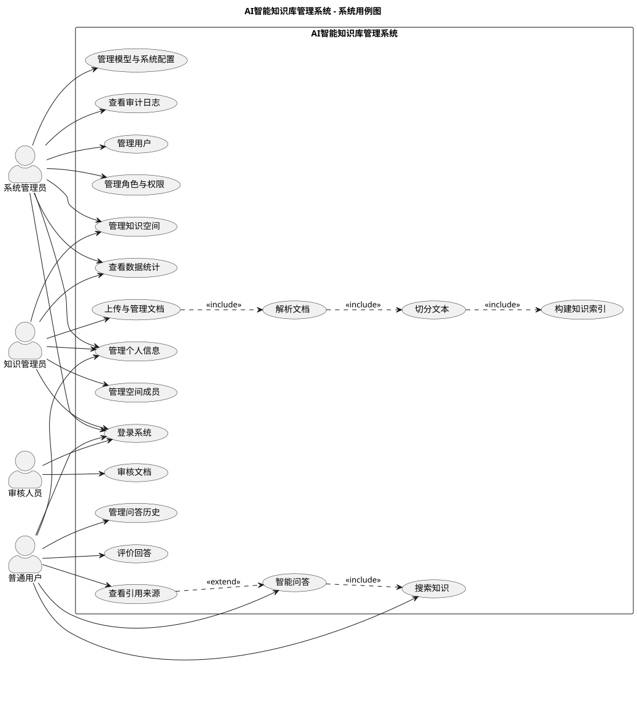

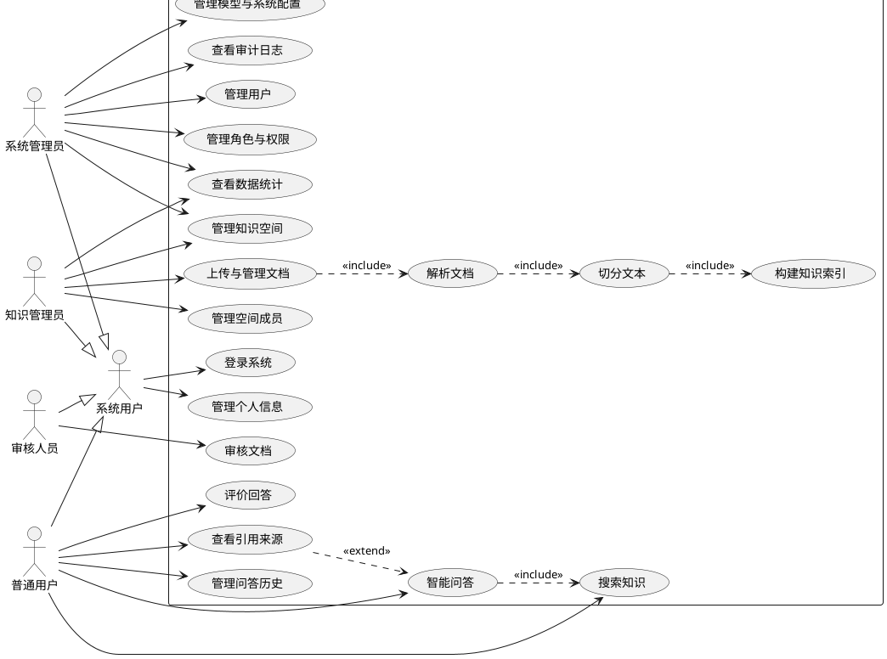
```plantuml
@startuml
left to right direction
!pragma layout smetana
skinparam packageStyle rectangle
skinparam linetype ortho
skinparam nodesep 45
skinparam ranksep 55

actor "系统用户" as SystemUser
actor "系统管理员" as Admin
actor "知识管理员" as KM
actor "审核人员" as Auditor
actor "普通用户" as User

Admin --|> SystemUser
KM --|> SystemUser
Auditor --|> SystemUser
User --|> SystemUser

rectangle "AI智能知识库管理系统" {
  usecase "登录系统" as UC_Login
  usecase "管理个人信息" as UC_Profile
  usecase "管理用户" as UC_User
  usecase "管理角色与权限" as UC_RBAC
  usecase "管理知识空间" as UC_Space
  usecase "管理空间成员" as UC_Member
  usecase "上传与管理文档" as UC_Doc
  usecase "审核文档" as UC_Audit
  usecase "解析文档" as UC_Parse
  usecase "切分文本" as UC_Chunk
  usecase "构建知识索引" as UC_Index
  usecase "搜索知识" as UC_Search
  usecase "智能问答" as UC_Chat
  usecase "查看引用来源" as UC_Citation
  usecase "管理问答历史" as UC_History
  usecase "评价回答" as UC_Feedback
  usecase "查看数据统计" as UC_Stats
  usecase "管理模型与系统配置" as UC_Config
  usecase "查看审计日志" as UC_Log
}

SystemUser --> UC_Login
SystemUser --> UC_Profile
Admin --> UC_User
Admin --> UC_RBAC
Admin --> UC_Space
Admin --> UC_Stats
Admin --> UC_Config
Admin --> UC_Log

KM --> UC_Space
KM --> UC_Member
KM --> UC_Doc
KM --> UC_Stats

Auditor --> UC_Audit

User --> UC_Search
User --> UC_Chat
User --> UC_History
User --> UC_Feedback

UC_Doc ..> UC_Parse : <<include>>
UC_Parse ..> UC_Chunk : <<include>>
UC_Chunk ..> UC_Index : <<include>>
UC_Chat ..> UC_Search : <<include>>
UC_Citation ..> UC_Chat : <<extend>>
User --> UC_Citation
@enduml
```

## 5.2 Mermaid 预览版

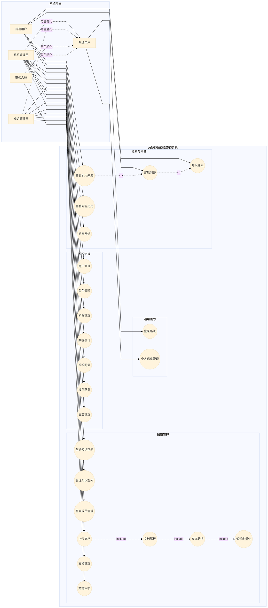
```mermaid
%%{init: {"theme":"base","themeVariables":{"fontFamily":"Microsoft YaHei, Arial, sans-serif"},"flowchart":{"curve":"linear","nodeSpacing":55,"rankSpacing":75,"padding":14,"useMaxWidth":false}}}%%
flowchart LR
    subgraph ACTORS["系统角色"]
        direction TB
        SystemUser["系统用户"]
        Admin["系统管理员"]
        KM["知识管理员"]
        Auditor["审核人员"]
        User["普通用户"]
    end

    Admin -. "角色特化" .-> SystemUser
    KM -. "角色特化" .-> SystemUser
    Auditor -. "角色特化" .-> SystemUser
    User -. "角色特化" .-> SystemUser

    subgraph SYS["AI智能知识库管理系统"]
        direction TB
        subgraph COMMON["通用能力"]
            direction LR
            UC1(("登录系统"))
            UC2(("个人信息管理"))
        end
        subgraph ADMIN["系统治理"]
            direction LR
            UC3(("用户管理"))
            UC4(("角色管理"))
            UC5(("权限管理"))
            UC20(("数据统计"))
            UC21(("系统配置"))
            UC22(("模型配置"))
            UC23(("日志管理"))
        end
        subgraph KNOWLEDGE["知识管理"]
            direction LR
            UC6(("创建知识空间"))
            UC7(("管理知识空间"))
            UC8(("空间成员管理"))
            UC9(("上传文档"))
            UC10(("文档管理"))
            UC19(("文档审核"))
            UC11(("文档解析"))
            UC12(("文本分块"))
            UC13(("知识向量化"))
        end
        subgraph QA["检索与问答"]
            direction LR
            UC14(("知识搜索"))
            UC15(("智能问答"))
            UC16(("查看引用来源"))
            UC17(("查看问答历史"))
            UC18(("问答反馈"))
        end
    end

    SystemUser --> UC1
    SystemUser --> UC2
    Admin --> UC3
    Admin --> UC4
    Admin --> UC5
    Admin --> UC7
    Admin --> UC20
    Admin --> UC21
    Admin --> UC22
    Admin --> UC23

    KM --> UC6
    KM --> UC7
    KM --> UC8
    KM --> UC9
    KM --> UC10
    KM --> UC20

    Auditor --> UC19

    User --> UC14
    User --> UC15
    User --> UC16
    User --> UC17
    User --> UC18

    UC9 -. "include" .-> UC11
    UC11 -. "include" .-> UC12
    UC12 -. "include" .-> UC13

    UC15 -. "<<include>>" .-> UC14
    UC16 -. "<<extend>>" .-> UC15
```

---

# 六、项目 WBS 任务分解

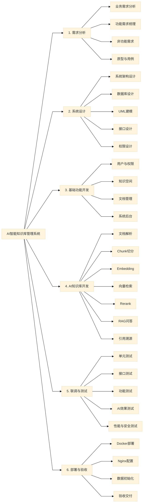
```mermaid
%%{init: {"theme":"base","themeVariables":{"fontFamily":"Microsoft YaHei, Arial, sans-serif"},"flowchart":{"curve":"linear","nodeSpacing":35,"rankSpacing":70,"padding":12,"useMaxWidth":false}}}%%
flowchart LR
    P["AI智能知识库管理系统"]

    P --> A["1. 需求分析"]
    P --> B["2. 系统设计"]
    P --> C["3. 基础功能开发"]
    P --> D["4. AI知识库开发"]
    P --> E["5. 联调与测试"]
    P --> F["6. 部署与验收"]

    A --> A1["业务需求分析"]
    A --> A2["功能需求梳理"]
    A --> A3["非功能需求"]
    A --> A4["原型与用例"]

    B --> B1["系统架构设计"]
    B --> B2["数据库设计"]
    B --> B3["UML建模"]
    B --> B4["接口设计"]
    B --> B5["权限设计"]

    C --> C1["用户与权限"]
    C --> C2["知识空间"]
    C --> C3["文档管理"]
    C --> C4["系统后台"]

    D --> D1["文档解析"]
    D --> D2["Chunk切分"]
    D --> D3["Embedding"]
    D --> D4["向量检索"]
    D --> D5["Rerank"]
    D --> D6["RAG问答"]
    D --> D7["引用溯源"]

    E --> E1["单元测试"]
    E --> E2["接口测试"]
    E --> E3["功能测试"]
    E --> E4["AI效果测试"]
    E --> E5["性能与安全测试"]

    F --> F1["Docker部署"]
    F --> F2["Nginx配置"]
    F --> F3["数据初始化"]
    F --> F4["验收交付"]
```

---

# 七、项目开发计划与人员分工

## 7.1 推荐 5 人团队

| 人员 | 角色 | 主要工作 |
|---|---|---|
| A | 项目负责人/后端 | 项目统筹、架构、认证、权限、用户 |
| B | 前端工程师 | 页面、知识空间、文档、问答 UI |
| C | 后端工程师 | 文档、数据统计、数据库、接口 |
| D | AI工程师 | 文档解析、Embedding、RAG、LLM |
| E | 测试/运维 | 测试、Docker、部署、项目文档 |

### 任务、时间、人员与交付物矩阵

| WBS | 任务 | 时间安排 | 主责 | 协作 | 核心交付物 |
|---|---|---|---|---|---|
| 1.1 | 需求调研与范围确认 | 第 1 周 | A | B、C、D | 需求规格说明书、用例清单 |
| 1.2 | 原型与交互设计 | 第 2 周 | B | A | 页面原型、交互说明 |
| 2.1 | 总体架构与权限设计 | 第 2～3 周 | A | C、D | 架构图、权限模型 |
| 2.2 | 数据库与 ER 设计 | 第 2～3 周 | C | A、D | ER 图、数字字典、DDL |
| 2.3 | UML 与接口设计 | 第 3 周 | A | B、C、D | UML 图、OpenAPI 草案 |
| 3.1 | 认证、用户与权限开发 | 第 4～5 周 | A | B、C | 认证授权模块 |
| 3.2 | 知识空间与文档开发 | 第 4～6 周 | C | B、A | 空间、文档模块 |
| 4.1 | 解析、切分与向量化 | 第 5～7 周 | D | C | 知识构建流水线 |
| 4.2 | 检索、Rerank 与 RAG 问答 | 第 7～9 周 | D | A、B | AI 问答服务、评测报告 |
| 5.1 | 统计、联调与系统测试 | 第 9～10 周 | E | 全员 | 测试报告、缺陷清单 |
| 6.1 | 部署、验收与移交 | 第 11 周 | E | A、C、D | 部署包、运维手册、验收报告 |

## 7.2 项目甘特图

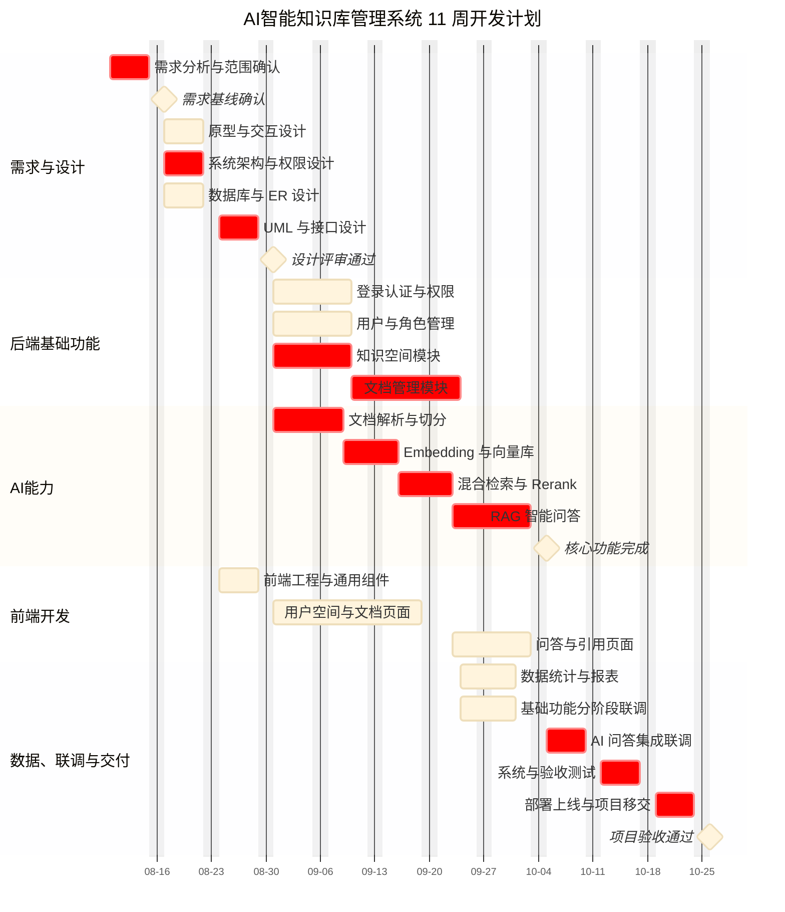
```mermaid
%%{init: {"theme":"base","themeVariables":{"fontFamily":"Microsoft YaHei, Arial, sans-serif"},"gantt":{"barHeight":24,"barGap":8,"topPadding":55,"leftPadding":110,"gridLineStartPadding":40,"fontSize":14,"sectionFontSize":15,"numberSectionStyles":4,"useMaxWidth":false}}}%%
gantt
    title AI智能知识库管理系统 11 周开发计划
    dateFormat  YYYY-MM-DD
    axisFormat  %m-%d
    excludes    weekends
    todayMarker off

    section 需求与设计
    需求分析与范围确认     :crit, a1, 2026-08-10, 5d
    需求基线确认           :milestone, m1, after a1, 0d
    原型与交互设计         :a2, after a1, 5d
    系统架构与权限设计     :crit, a3, after a1, 5d
    数据库与 ER 设计       :a4, after a1, 5d
    UML 与接口设计        :crit, a5, after a3, 5d
    设计评审通过           :milestone, m2, after a5, 0d

    section 后端基础功能
    登录认证与权限       :b1, after a5, 8d
    用户与角色管理       :b2, after a5, 8d
    知识空间模块         :crit, b3, after a5, 8d
    文档管理模块         :crit, b4, after b3, 10d

    section AI能力
    文档解析与切分       :crit, c1, after a5, 7d
    Embedding 与向量库   :crit, c2, after c1, 5d
    混合检索与 Rerank    :crit, c3, after c2, 5d
    RAG 智能问答         :crit, c4, after c3, 8d
    核心功能完成           :milestone, m3, after c4, 0d

    section 前端开发
    前端工程与通用组件     :f1, after a2, 5d
    用户空间与文档页面   :f2, after a5, 15d
    问答与引用页面       :f3, after c3, 8d

    section 数据、联调与交付
    数据统计与报表       :d1, after b4, 5d
    基础功能分阶段联调     :e1, after b4, 5d
    AI 问答集成联调       :crit, e2, after c4, 5d
    系统与验收测试       :crit, e3, after e2, 5d
    部署上线与项目移交     :crit, e4, after e3, 5d
    项目验收通过           :milestone, m4, after e4, 0d
```

> 计划基线：2026-08-10 至 2026-10-23，共 11 个自然周；任务工期按工作日计算，默认排除周六和周日。`crit` 表示关键路径，菱形节点表示里程碑。

---

# 八、系统总体架构图

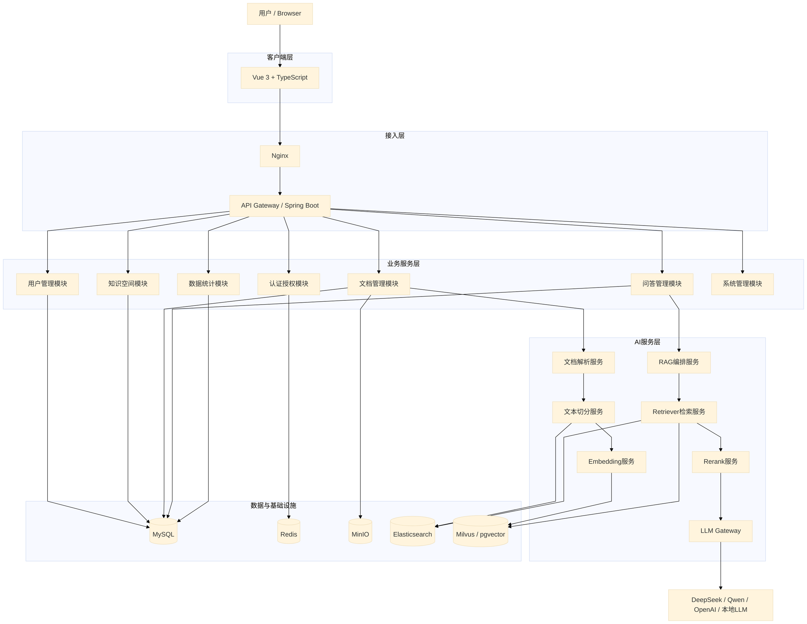
```mermaid
%%{init: {"theme":"base","themeVariables":{"fontFamily":"Microsoft YaHei, Arial, sans-serif"},"flowchart":{"curve":"linear","nodeSpacing":45,"rankSpacing":70,"padding":14,"useMaxWidth":false}}}%%
flowchart TB
    U["用户 / Browser"]

    subgraph FE["客户端层"]
        direction LR
        WEB["Vue 3 + TypeScript"]
    end

    subgraph ACCESS["接入层"]
        direction LR
        NGINX["Nginx"]
        GATEWAY["API Gateway / Spring Boot"]
    end

    subgraph BIZ["业务服务层"]
        direction LR
        AUTH["认证授权模块"]
        USER["用户管理模块"]
        SPACE["知识空间模块"]
        DOC["文档管理模块"]
        CHAT["问答管理模块"]
        STAT["数据统计模块"]
        SYS["系统管理模块"]
    end

    subgraph AI["AI服务层"]
        direction LR
        PARSER["文档解析服务"]
        CHUNK["文本切分服务"]
        EMB["Embedding服务"]
        RET["Retriever检索服务"]
        RR["Rerank服务"]
        RAG["RAG编排服务"]
        LLMGW["LLM Gateway"]
    end

    subgraph DATA["数据与基础设施"]
        direction LR
        MYSQL[("MySQL")]
        REDIS[("Redis")]
        MINIO[("MinIO")]
        ES[("Elasticsearch")]
        VECTOR[("Milvus / pgvector")]
    end

    MODEL["DeepSeek / Qwen / OpenAI / 本地LLM"]

    U --> WEB
    WEB --> NGINX
    NGINX --> GATEWAY

    GATEWAY --> AUTH
    GATEWAY --> USER
    GATEWAY --> SPACE
    GATEWAY --> DOC
    GATEWAY --> CHAT
    GATEWAY --> STAT
    GATEWAY --> SYS

    AUTH --> REDIS
    USER --> MYSQL
    SPACE --> MYSQL
    DOC --> MYSQL
    DOC --> MINIO
    CHAT --> MYSQL
    STAT --> MYSQL

    DOC --> PARSER
    PARSER --> CHUNK
    CHUNK --> EMB
    EMB --> VECTOR
    CHUNK --> ES

    CHAT --> RAG
    RAG --> RET
    RET --> VECTOR
    RET --> ES
    RET --> RR
    RR --> LLMGW
    LLMGW --> MODEL
```

---

# 九、系统模块架构图

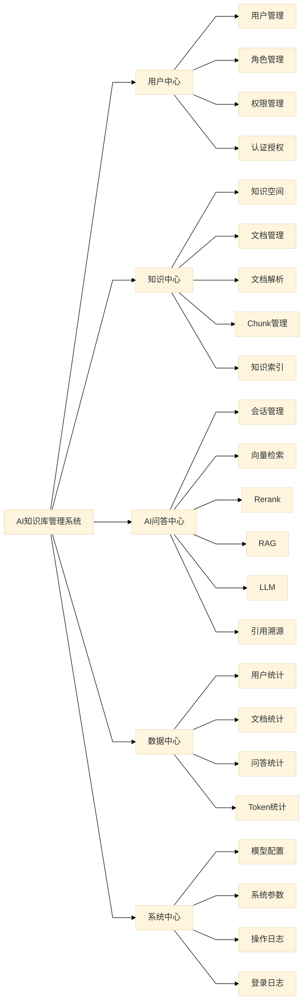
```mermaid
%%{init: {"theme":"base","themeVariables":{"fontFamily":"Microsoft YaHei, Arial, sans-serif"},"flowchart":{"curve":"linear","nodeSpacing":38,"rankSpacing":75,"padding":12,"useMaxWidth":false}}}%%
flowchart LR
    SYS["AI知识库管理系统"]

    SYS --> UM["用户中心"]
    SYS --> KB["知识中心"]
    SYS --> QA["AI问答中心"]
    SYS --> DS["数据中心"]
    SYS --> SM["系统中心"]

    UM --> U1["用户管理"]
    UM --> U2["角色管理"]
    UM --> U3["权限管理"]
    UM --> U4["认证授权"]

    KB --> K1["知识空间"]
    KB --> K2["文档管理"]
    KB --> K3["文档解析"]
    KB --> K4["Chunk管理"]
    KB --> K5["知识索引"]

    QA --> Q1["会话管理"]
    QA --> Q2["向量检索"]
    QA --> Q3["Rerank"]
    QA --> Q4["RAG"]
    QA --> Q5["LLM"]
    QA --> Q6["引用溯源"]

    DS --> D1["用户统计"]
    DS --> D2["文档统计"]
    DS --> D3["问答统计"]
    DS --> D4["Token统计"]

    SM --> S1["模型配置"]
    SM --> S2["系统参数"]
    SM --> S3["操作日志"]
    SM --> S4["登录日志"]
```

---

# 十、系统类图

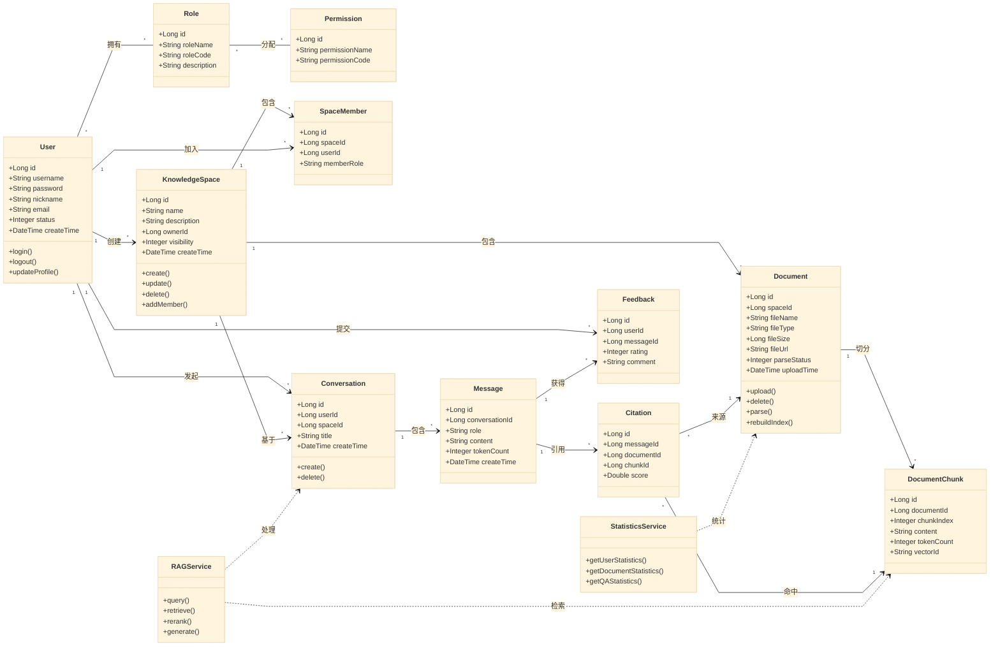
```mermaid
%%{init: {"theme":"base","themeVariables":{"fontFamily":"Microsoft YaHei, Arial, sans-serif"},"class":{"useMaxWidth":false},"flowchart":{"curve":"linear","nodeSpacing":45,"rankSpacing":70}}}%%
classDiagram
    direction LR

    class User {
        +Long id
        +String username
        +String password
        +String nickname
        +String email
        +Integer status
        +DateTime createTime
        +login()
        +logout()
        +updateProfile()
    }

    class Role {
        +Long id
        +String roleName
        +String roleCode
        +String description
    }

    class Permission {
        +Long id
        +String permissionName
        +String permissionCode
    }

    class KnowledgeSpace {
        +Long id
        +String name
        +String description
        +Long ownerId
        +Integer visibility
        +DateTime createTime
        +create()
        +update()
        +delete()
        +addMember()
    }

    class SpaceMember {
        +Long id
        +Long spaceId
        +Long userId
        +String memberRole
    }

    class Document {
        +Long id
        +Long spaceId
        +String fileName
        +String fileType
        +Long fileSize
        +String fileUrl
        +Integer parseStatus
        +DateTime uploadTime
        +upload()
        +delete()
        +parse()
        +rebuildIndex()
    }

    class DocumentChunk {
        +Long id
        +Long documentId
        +Integer chunkIndex
        +String content
        +Integer tokenCount
        +String vectorId
    }

    class Conversation {
        +Long id
        +Long userId
        +Long spaceId
        +String title
        +DateTime createTime
        +create()
        +delete()
    }

    class Message {
        +Long id
        +Long conversationId
        +String role
        +String content
        +Integer tokenCount
        +DateTime createTime
    }

    class Citation {
        +Long id
        +Long messageId
        +Long documentId
        +Long chunkId
        +Double score
    }

    class Feedback {
        +Long id
        +Long userId
        +Long messageId
        +Integer rating
        +String comment
    }

    class RAGService {
        +query()
        +retrieve()
        +rerank()
        +generate()
    }

    class StatisticsService {
        +getUserStatistics()
        +getDocumentStatistics()
        +getQAStatistics()
    }

    User "*" -- "*" Role : 拥有
    Role "*" -- "*" Permission : 分配
    User "1" --> "*" KnowledgeSpace : 创建
    KnowledgeSpace "1" --> "*" SpaceMember : 包含
    User "1" --> "*" SpaceMember : 加入
    KnowledgeSpace "1" --> "*" Document : 包含
    Document "1" --> "*" DocumentChunk : 切分
    User "1" --> "*" Conversation : 发起
    KnowledgeSpace "1" --> "*" Conversation : 基于
    Conversation "1" --> "*" Message : 包含
    Message "1" --> "*" Citation : 引用
    Citation "*" --> "1" Document : 来源
    Citation "*" --> "1" DocumentChunk : 命中
    User "1" --> "*" Feedback : 提交
    Message "1" --> "*" Feedback : 获得

    RAGService ..> DocumentChunk : 检索
    RAGService ..> Conversation : 处理
    StatisticsService ..> Document : 统计
```

---

# 十一、文档处理活动图

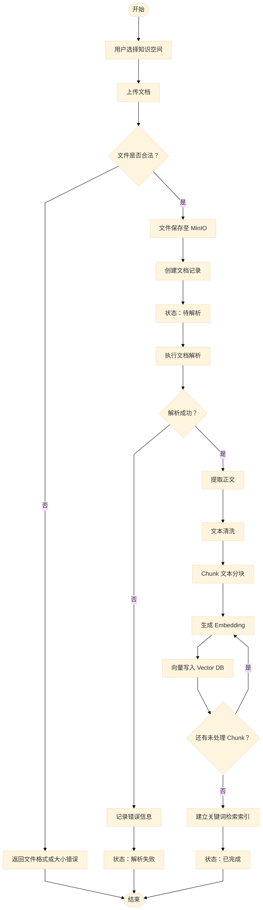
```mermaid
%%{init: {"theme":"base","themeVariables":{"fontFamily":"Microsoft YaHei, Arial, sans-serif"},"flowchart":{"curve":"linear","nodeSpacing":45,"rankSpacing":65,"padding":12,"useMaxWidth":false}}}%%
flowchart TD
    A([开始]) --> B["用户选择知识空间"]
    B --> C["上传文档"]
    C --> D{"文件是否合法？"}

    D -- 否 --> E["返回文件格式或大小错误"]
    E --> Z([结束])

    D -- 是 --> F["文件保存至 MinIO"]
    F --> G["创建文档记录"]
    G --> H["状态：待解析"]
    H --> I["执行文档解析"]
    I --> J{"解析成功？"}

    J -- 否 --> K["记录错误信息"]
    K --> L["状态：解析失败"]
    L --> Z

    J -- 是 --> M["提取正文"]
    M --> N["文本清洗"]
    N --> O["Chunk 文本分块"]
    O --> P["生成 Embedding"]
    P --> Q["向量写入 Vector DB"]
    Q --> R{"还有未处理 Chunk？"}

    R -- 是 --> P
    R -- 否 --> S["建立关键词检索索引"]
    S --> T["状态：已完成"]
    T --> Z
```

---

# 十二、智能问答活动图

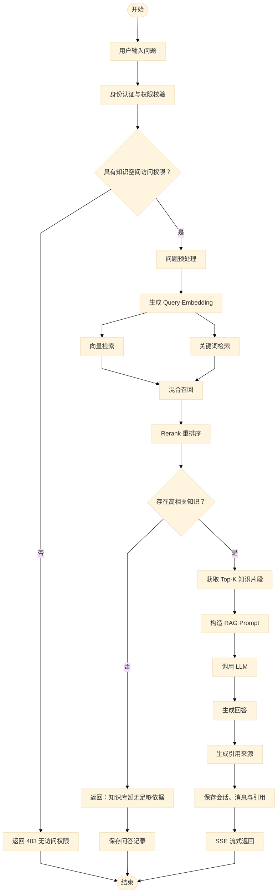
```mermaid
%%{init: {"theme":"base","themeVariables":{"fontFamily":"Microsoft YaHei, Arial, sans-serif"},"flowchart":{"curve":"linear","nodeSpacing":55,"rankSpacing":65,"padding":12,"useMaxWidth":false}}}%%
flowchart TD
    A([开始]) --> B["用户输入问题"]
    B --> C["身份认证与权限校验"]
    C --> D{"具有知识空间访问权限？"}

    D -- 否 --> E["返回 403 无访问权限"]
    E --> Z([结束])

    D -- 是 --> F["问题预处理"]
    F --> G["生成 Query Embedding"]

    G --> H1["向量检索"]
    G --> H2["关键词检索"]

    H1 --> I["混合召回"]
    H2 --> I

    I --> J["Rerank 重排序"]
    J --> K{"存在高相关知识？"}

    K -- 否 --> L["返回：知识库暂无足够依据"]
    L --> M["保存问答记录"]
    M --> Z

    K -- 是 --> N["获取 Top-K 知识片段"]
    N --> O["构造 RAG Prompt"]
    O --> P["调用 LLM"]
    P --> Q["生成回答"]
    Q --> R["生成引用来源"]
    R --> S["保存会话、消息与引用"]
    S --> T["SSE 流式返回"]
    T --> Z
```

---

# 十三、知识库 RAG 核心流程图

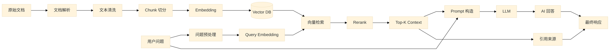
```mermaid
%%{init: {"theme":"base","themeVariables":{"fontFamily":"Microsoft YaHei, Arial, sans-serif"},"flowchart":{"curve":"linear","nodeSpacing":40,"rankSpacing":65,"padding":12,"useMaxWidth":false}}}%%
flowchart LR
    DOC["原始文档"] --> PARSE["文档解析"]
    PARSE --> CLEAN["文本清洗"]
    CLEAN --> CHUNK["Chunk 切分"]
    CHUNK --> EMB1["Embedding"]
    EMB1 --> VDB[("Vector DB")]

    Q["用户问题"] --> PRE["问题预处理"]
    PRE --> EMB2["Query Embedding"]
    EMB2 --> RET["向量检索"]

    VDB --> RET
    RET --> RR["Rerank"]
    RR --> CTX["Top-K Context"]
    CTX --> PROMPT["Prompt 构造"]
    Q --> PROMPT
    PROMPT --> LLM["LLM"]
    LLM --> ANS["AI 回答"]
    CTX --> CITE["引用来源"]
    ANS --> OUT["最终响应"]
    CITE --> OUT
```

---

# 十四、ER 图

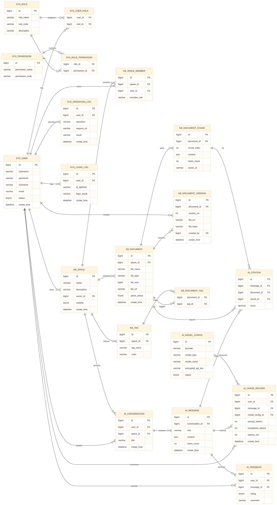
```mermaid
%%{init: {"theme":"base","themeVariables":{"fontFamily":"Microsoft YaHei, Arial, sans-serif"},"er":{"useMaxWidth":false,"diagramPadding":28,"layoutDirection":"LR","minEntityWidth":120,"minEntityHeight":80,"entityPadding":20,"stroke":"gray","fill":"honeydew","fontSize":13}}}%%
erDiagram
    direction LR

    SYS_USER {
        bigint id PK
        varchar username
        varchar password
        varchar nickname
        varchar email
        tinyint status
        datetime create_time
    }

    SYS_ROLE {
        bigint id PK
        varchar role_name
        varchar role_code
        varchar description
    }

    SYS_PERMISSION {
        bigint id PK
        varchar permission_name
        varchar permission_code
    }

    SYS_USER_ROLE {
        bigint user_id FK
        bigint role_id FK
    }

    SYS_ROLE_PERMISSION {
        bigint role_id FK
        bigint permission_id FK
    }

    KB_SPACE {
        bigint id PK
        varchar name
        varchar description
        bigint owner_id FK
        tinyint visibility
        datetime create_time
    }

    KB_SPACE_MEMBER {
        bigint id PK
        bigint space_id FK
        bigint user_id FK
        varchar member_role
    }

    KB_DOCUMENT {
        bigint id PK
        bigint space_id FK
        varchar file_name
        varchar file_type
        bigint file_size
        varchar file_url
        tinyint parse_status
        datetime create_time
    }

    KB_DOCUMENT_CHUNK {
        bigint id PK
        bigint document_id FK
        int chunk_index
        text content
        int token_count
        varchar vector_id
    }

    KB_DOCUMENT_VERSION {
        bigint id PK
        bigint document_id FK
        int version_no
        varchar file_url
        varchar file_hash
        bigint created_by FK
        datetime create_time
    }

    KB_TAG {
        bigint id PK
        bigint space_id FK
        varchar tag_name
        varchar color
    }

    KB_DOCUMENT_TAG {
        bigint document_id FK
        bigint tag_id FK
    }

    AI_CONVERSATION {
        bigint id PK
        bigint user_id FK
        bigint space_id FK
        varchar title
        datetime create_time
    }

    AI_MESSAGE {
        bigint id PK
        bigint conversation_id FK
        varchar role
        text content
        int token_count
        datetime create_time
    }

    AI_CITATION {
        bigint id PK
        bigint message_id FK
        bigint document_id FK
        bigint chunk_id FK
        decimal score
    }

    AI_FEEDBACK {
        bigint id PK
        bigint user_id FK
        bigint message_id FK
        tinyint rating
        varchar comment
    }

    AI_MODEL_CONFIG {
        bigint id PK
        varchar provider
        varchar model_type
        varchar model_name
        varchar encrypted_api_key
        tinyint status
    }

    AI_USAGE_RECORD {
        bigint id PK
        bigint user_id FK
        bigint message_id FK
        bigint model_config_id FK
        int prompt_tokens
        int completion_tokens
        int latency_ms
        datetime create_time
    }

    SYS_OPERATION_LOG {
        bigint id PK
        bigint user_id FK
        varchar operation
        varchar request_uri
        varchar result
        datetime create_time
    }

    SYS_LOGIN_LOG {
        bigint id PK
        bigint user_id FK
        varchar ip_address
        varchar login_result
        datetime create_time
    }

    SYS_USER ||--o{ SYS_USER_ROLE : has
    SYS_ROLE ||--o{ SYS_USER_ROLE : assigned

    SYS_ROLE ||--o{ SYS_ROLE_PERMISSION : has
    SYS_PERMISSION ||--o{ SYS_ROLE_PERMISSION : contains

    SYS_USER ||--o{ KB_SPACE : owns
    SYS_USER ||--o{ KB_SPACE_MEMBER : joins
    KB_SPACE ||--o{ KB_SPACE_MEMBER : contains

    KB_SPACE ||--o{ KB_DOCUMENT : contains
    KB_DOCUMENT ||--o{ KB_DOCUMENT_CHUNK : splits
    KB_DOCUMENT ||--o{ KB_DOCUMENT_VERSION : versions
    SYS_USER ||--o{ KB_DOCUMENT_VERSION : creates
    KB_SPACE ||--o{ KB_TAG : defines
    KB_DOCUMENT ||--o{ KB_DOCUMENT_TAG : tagged
    KB_TAG ||--o{ KB_DOCUMENT_TAG : maps

    SYS_USER ||--o{ AI_CONVERSATION : creates
    KB_SPACE ||--o{ AI_CONVERSATION : grounds
    AI_CONVERSATION ||--o{ AI_MESSAGE : contains

    AI_MESSAGE ||--o{ AI_CITATION : cites
    KB_DOCUMENT ||--o{ AI_CITATION : source
    KB_DOCUMENT_CHUNK ||--o{ AI_CITATION : hit

    SYS_USER ||--o{ AI_FEEDBACK : submits
    AI_MESSAGE ||--o{ AI_FEEDBACK : receives
    SYS_USER ||--o{ AI_USAGE_RECORD : consumes
    AI_MESSAGE ||--o{ AI_USAGE_RECORD : records
    AI_MODEL_CONFIG ||--o{ AI_USAGE_RECORD : measures
    SYS_USER ||--o{ SYS_OPERATION_LOG : operates
    SYS_USER ||--o{ SYS_LOGIN_LOG : logs
```

---

# 十五、核心数据库表清单

| 表名 | 说明 |
|---|---|
| sys_user | 用户 |
| sys_role | 角色 |
| sys_permission | 权限 |
| sys_user_role | 用户角色关系 |
| sys_role_permission | 角色权限关系 |
| kb_space | 知识空间 |
| kb_space_member | 空间成员 |
| kb_document | 文档 |
| kb_document_version | 文档版本 |
| kb_document_chunk | 文档切片 |
| kb_tag | 标签 |
| kb_document_tag | 文档标签关系 |
| ai_conversation | AI会话 |
| ai_message | AI消息 |
| ai_citation | 回答引用 |
| ai_feedback | 用户反馈 |
| ai_model_config | 模型配置 |
| ai_usage_record | 模型调用记录 |
| sys_operation_log | 操作日志 |
| sys_login_log | 登录日志 |

---

# 十六、接口设计规范

统一前缀：

```text
/api/v1
```

统一返回：

```json
{
  "code": 200,
  "message": "success",
  "data": {}
}
```

认证：

```text
Authorization: Bearer {JWT}
```

## 16.1 通用请求规则

| 项目 | 规则 |
|---|---|
| Content-Type | JSON 接口使用 `application/json`；上传使用 `multipart/form-data` |
| 分页 | `page` 从 1 开始，`size` 默认 20，最大 100 |
| 排序 | `sort=field,asc|desc`，只允许服务端白名单字段 |
| 时间 | ISO 8601，统一使用带时区时间 |
| 幂等 | 创建和上传类接口支持 `Idempotency-Key` |
| 请求追踪 | 客户端可传 `X-Request-Id`，服务端必须在响应中返回 |
| 数据权限 | 服务端从 Token 识别用户，不信任请求体中的 userId |

## 16.2 统一响应与分页结构

```json
{
  "code": 200,
  "message": "success",
  "data": {
    "list": [],
    "page": 1,
    "size": 20,
    "total": 0
  },
  "requestId": "01J...",
  "timestamp": "2026-08-10T09:00:00+08:00"
}
```

## 16.3 接口权限标记

| 标记 | 说明 |
|---|---|
| Public | 无需登录，仅用于登录、Token 刷新等接口 |
| Authenticated | 任意有效登录用户 |
| System Permission | 需要 RBAC 权限码，如 `system:user:read` |
| Space Role | 需要 OWNER / ADMIN / EDITOR / READER 之一 |

## 16.4 核心接口契约示例

### 文档上传

`POST /api/v1/spaces/{spaceId}/documents`

- 权限：Space Role = OWNER / ADMIN / EDITOR
- 请求：`file`（必填）、`name`、`tagIds`
- 响应：HTTP 202，返回 `documentId`、`taskId`、`status=WAITING_PARSE`
- 错误：30002 格式不支持，30004 文件超限，30005 文件重复

### SSE 流式问答

`POST /api/v1/conversations/{conversationId}/stream`

- 权限：Authenticated，且对会话所属空间至少具有 READER 权限
- 请求：`question`、`spaceIds`、`modelConfigId`、`historyLimit`
- 事件：`metadata`、`delta`、`citation`、`usage`、`done`、`error`
- 错误：20002 无空间权限，40001 AI 服务不可用，40004 模型调用失败

> 接口清单用于范围确认；开发阶段应以 OpenAPI 3.0 文件继续维护完整的字段级契约。

---

# 十七、接口清单

## 17.1 认证与用户接口

| 方法 | URL | 功能 |
|---|---|---|
| POST | /auth/login | 用户登录 |
| POST | /auth/logout | 用户退出 |
| POST | /auth/refresh | 刷新 Token |
| GET | /users/me | 当前用户 |
| PUT | /users/me | 修改个人资料 |
| PUT | /users/password | 修改密码 |
| GET | /users | 用户分页列表 |
| POST | /users | 创建用户 |
| GET | /users/{id} | 用户详情 |
| PUT | /users/{id} | 修改用户 |
| DELETE | /users/{id} | 删除用户 |
| PUT | /users/{id}/status | 启用/禁用 |

## 17.2 角色权限接口

| 方法 | URL | 功能 |
|---|---|---|
| GET | /roles | 角色列表 |
| POST | /roles | 新建角色 |
| PUT | /roles/{id} | 修改角色 |
| DELETE | /roles/{id} | 删除角色 |
| GET | /permissions | 权限列表 |
| POST | /roles/{id}/permissions | 分配权限 |
| POST | /users/{id}/roles | 分配角色 |

## 17.3 知识空间接口

| 方法 | URL | 功能 |
|---|---|---|
| GET | /spaces | 空间列表 |
| POST | /spaces | 创建空间 |
| GET | /spaces/{id} | 空间详情 |
| PUT | /spaces/{id} | 修改空间 |
| DELETE | /spaces/{id} | 删除空间 |
| GET | /spaces/{id}/members | 成员列表 |
| POST | /spaces/{id}/members | 添加成员 |
| PUT | /spaces/{id}/members/{userId} | 修改成员权限 |
| DELETE | /spaces/{id}/members/{userId} | 移除成员 |

## 17.4 文档接口

| 方法 | URL | 功能 |
|---|---|---|
| POST | /spaces/{id}/documents | 上传文档 |
| GET | /spaces/{id}/documents | 文档列表 |
| GET | /documents/{id} | 文档详情 |
| PUT | /documents/{id} | 修改文档 |
| DELETE | /documents/{id} | 删除文档 |
| GET | /documents/{id}/download | 下载 |
| GET | /documents/{id}/preview | 预览 |
| POST | /documents/{id}/parse | 重新解析 |
| GET | /documents/{id}/status | 解析状态 |
| GET | /documents/{id}/chunks | Chunk 列表 |
| GET | /documents/{id}/versions | 版本列表 |

## 17.5 AI 问答接口

| 方法 | URL | 功能 |
|---|---|---|
| POST | /conversations | 创建会话 |
| GET | /conversations | 会话列表 |
| GET | /conversations/{id} | 会话详情 |
| DELETE | /conversations/{id} | 删除会话 |
| POST | /conversations/{id}/chat | 普通问答 |
| POST | /conversations/{id}/stream | SSE 流式问答 |
| GET | /messages/{id}/citations | 引用来源 |
| POST | /messages/{id}/feedback | 问答评价 |

## 17.6 统计接口

| 方法 | URL | 功能 |
|---|---|---|
| GET | /statistics/overview | 系统总览 |
| GET | /statistics/users | 用户统计 |
| GET | /statistics/spaces | 空间统计 |
| GET | /statistics/documents | 文档统计 |
| GET | /statistics/questions | 问答统计 |
| GET | /statistics/models | 模型调用统计 |
| GET | /statistics/tokens | Token 统计 |

---

# 十八、登录时序图

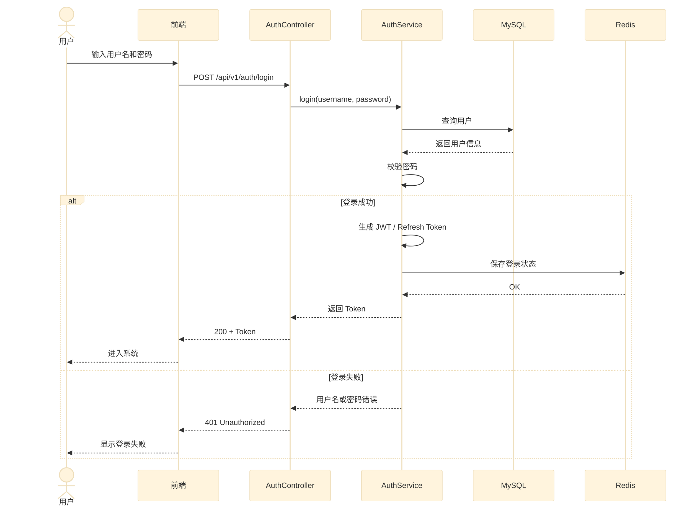
```mermaid
%%{init: {"theme":"base","themeVariables":{"fontFamily":"Microsoft YaHei, Arial, sans-serif"},"sequence":{"useMaxWidth":false,"diagramMarginX":55,"diagramMarginY":20,"actorMargin":65,"width":170,"height":65,"boxMargin":12,"messageMargin":35,"noteMargin":12,"wrap":true}}}%%
sequenceDiagram
    actor U as 用户
    participant F as 前端
    participant C as AuthController
    participant S as AuthService
    participant DB as MySQL
    participant R as Redis

    U->>F: 输入用户名和密码
    F->>C: POST /api/v1/auth/login
    C->>S: login(username, password)
    S->>DB: 查询用户
    DB-->>S: 返回用户信息
    S->>S: 校验密码

    alt 登录成功
        S->>S: 生成 JWT / Refresh Token
        S->>R: 保存登录状态
        R-->>S: OK
        S-->>C: 返回 Token
        C-->>F: 200 + Token
        F-->>U: 进入系统
    else 登录失败
        S-->>C: 用户名或密码错误
        C-->>F: 401 Unauthorized
        F-->>U: 显示登录失败
    end
```

---

# 十九、文档上传与知识构建时序图

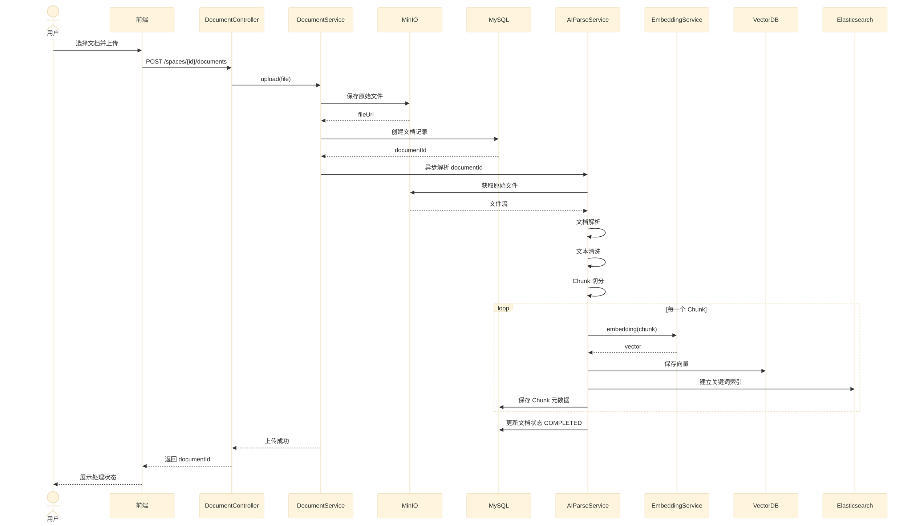
```mermaid
%%{init: {"theme":"base","themeVariables":{"fontFamily":"Microsoft YaHei, Arial, sans-serif"},"sequence":{"useMaxWidth":false,"diagramMarginX":55,"diagramMarginY":20,"actorMargin":65,"width":170,"height":65,"boxMargin":12,"messageMargin":35,"noteMargin":12,"wrap":true}}}%%
sequenceDiagram
    actor U as 用户
    participant F as 前端
    participant C as DocumentController
    participant S as DocumentService
    participant M as MinIO
    participant DB as MySQL
    participant P as AIParseService
    participant E as EmbeddingService
    participant V as VectorDB
    participant ES as Elasticsearch

    U->>F: 选择文档并上传
    F->>C: POST /spaces/{id}/documents
    C->>S: upload(file)

    S->>M: 保存原始文件
    M-->>S: fileUrl
    S->>DB: 创建文档记录
    DB-->>S: documentId

    S->>P: 异步解析 documentId
    P->>M: 获取原始文件
    M-->>P: 文件流

    P->>P: 文档解析
    P->>P: 文本清洗
    P->>P: Chunk 切分

    loop 每一个 Chunk
        P->>E: embedding(chunk)
        E-->>P: vector
        P->>V: 保存向量
        P->>ES: 建立关键词索引
        P->>DB: 保存 Chunk 元数据
    end

    P->>DB: 更新文档状态 COMPLETED
    S-->>C: 上传成功
    C-->>F: 返回 documentId
    F-->>U: 展示处理状态
```

---

# 二十、智能问答时序图

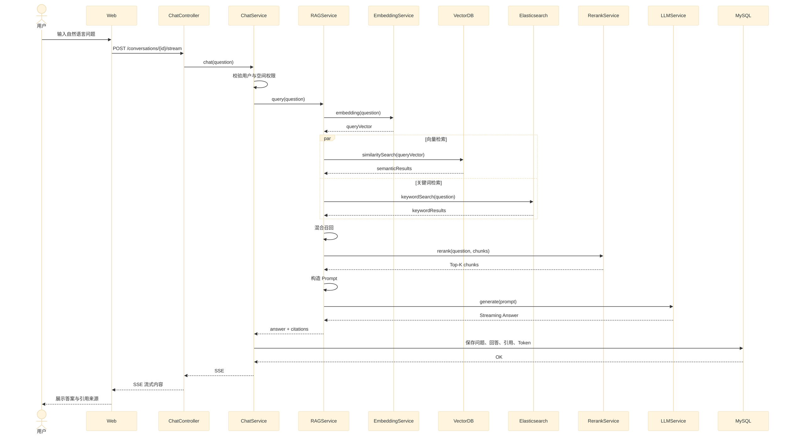
```mermaid
%%{init: {"theme":"base","themeVariables":{"fontFamily":"Microsoft YaHei, Arial, sans-serif"},"sequence":{"useMaxWidth":false,"diagramMarginX":55,"diagramMarginY":20,"actorMargin":65,"width":170,"height":65,"boxMargin":12,"messageMargin":35,"noteMargin":12,"wrap":true}}}%%
sequenceDiagram
    actor U as 用户
    participant W as Web
    participant C as ChatController
    participant S as ChatService
    participant RAG as RAGService
    participant E as EmbeddingService
    participant V as VectorDB
    participant ES as Elasticsearch
    participant RR as RerankService
    participant L as LLMService
    participant DB as MySQL

    U->>W: 输入自然语言问题
    W->>C: POST /conversations/{id}/stream
    C->>S: chat(question)
    S->>S: 校验用户与空间权限

    S->>RAG: query(question)
    RAG->>E: embedding(question)
    E-->>RAG: queryVector

    par 向量检索
        RAG->>V: similaritySearch(queryVector)
        V-->>RAG: semanticResults
    and 关键词检索
        RAG->>ES: keywordSearch(question)
        ES-->>RAG: keywordResults
    end

    RAG->>RAG: 混合召回
    RAG->>RR: rerank(question, chunks)
    RR-->>RAG: Top-K chunks

    RAG->>RAG: 构造 Prompt
    RAG->>L: generate(prompt)
    L-->>RAG: Streaming Answer

    RAG-->>S: answer + citations
    S->>DB: 保存问题、回答、引用、Token
    DB-->>S: OK

    S-->>C: SSE
    C-->>W: SSE 流式内容
    W-->>U: 展示答案与引用来源
```

---

# 二十一、知识检索时序图

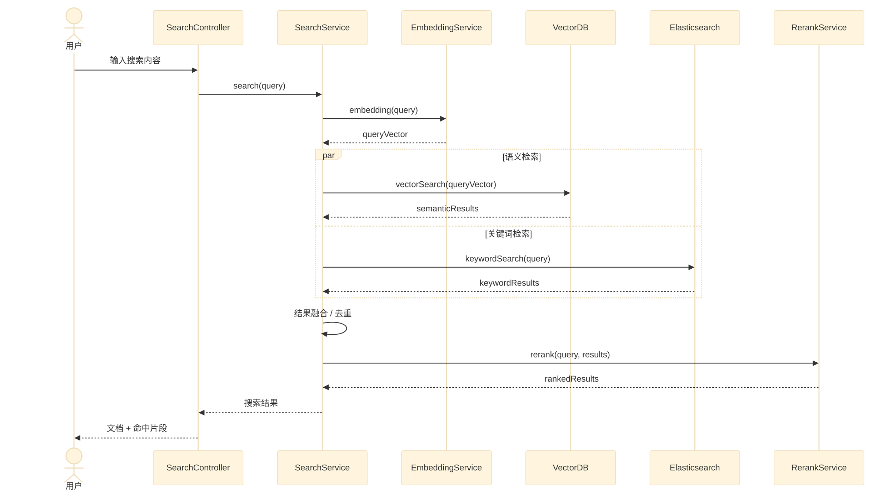
```mermaid
%%{init: {"theme":"base","themeVariables":{"fontFamily":"Microsoft YaHei, Arial, sans-serif"},"sequence":{"useMaxWidth":false,"diagramMarginX":55,"diagramMarginY":20,"actorMargin":65,"width":170,"height":65,"boxMargin":12,"messageMargin":35,"noteMargin":12,"wrap":true}}}%%
sequenceDiagram
    actor U as 用户
    participant C as SearchController
    participant S as SearchService
    participant E as EmbeddingService
    participant V as VectorDB
    participant ES as Elasticsearch
    participant RR as RerankService

    U->>C: 输入搜索内容
    C->>S: search(query)
    S->>E: embedding(query)
    E-->>S: queryVector

    par 语义检索
        S->>V: vectorSearch(queryVector)
        V-->>S: semanticResults
    and 关键词检索
        S->>ES: keywordSearch(query)
        ES-->>S: keywordResults
    end

    S->>S: 结果融合 / 去重
    S->>RR: rerank(query, results)
    RR-->>S: rankedResults
    S-->>C: 搜索结果
    C-->>U: 文档 + 命中片段
```

---

# 二十二、知识空间权限判断时序图

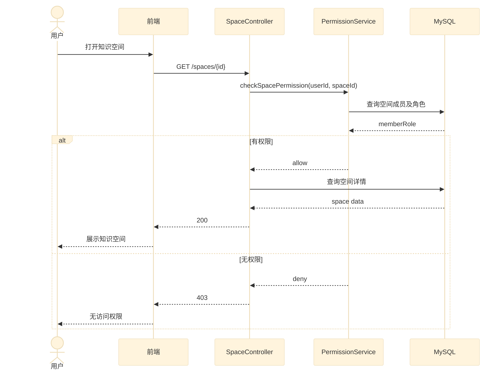
```mermaid
%%{init: {"theme":"base","themeVariables":{"fontFamily":"Microsoft YaHei, Arial, sans-serif"},"sequence":{"useMaxWidth":false,"diagramMarginX":55,"diagramMarginY":20,"actorMargin":65,"width":170,"height":65,"boxMargin":12,"messageMargin":35,"noteMargin":12,"wrap":true}}}%%
sequenceDiagram
    actor U as 用户
    participant F as 前端
    participant C as SpaceController
    participant P as PermissionService
    participant DB as MySQL

    U->>F: 打开知识空间
    F->>C: GET /spaces/{id}
    C->>P: checkSpacePermission(userId, spaceId)
    P->>DB: 查询空间成员及角色
    DB-->>P: memberRole

    alt 有权限
        P-->>C: allow
        C->>DB: 查询空间详情
        DB-->>C: space data
        C-->>F: 200
        F-->>U: 展示知识空间
    else 无权限
        P-->>C: deny
        C-->>F: 403
        F-->>U: 无访问权限
    end
```

---

# 二十三、部署架构图

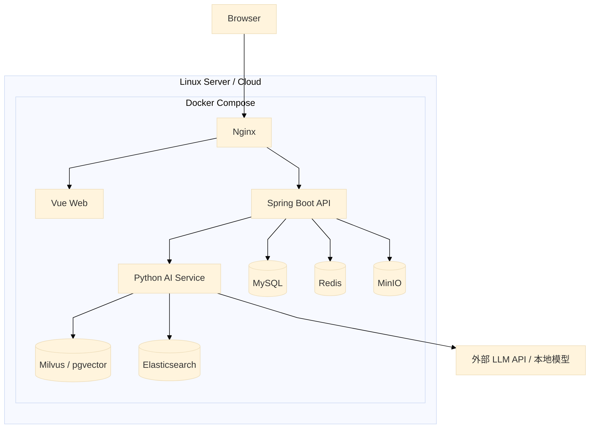
```mermaid
%%{init: {"theme":"base","themeVariables":{"fontFamily":"Microsoft YaHei, Arial, sans-serif"},"flowchart":{"curve":"linear","nodeSpacing":50,"rankSpacing":75,"padding":14,"useMaxWidth":false}}}%%
flowchart TB
    B["Browser"]

    subgraph SERVER["Linux Server / Cloud"]
        subgraph DOCKER["Docker Compose"]
            direction LR
            N["Nginx"]
            FE["Vue Web"]
            API["Spring Boot API"]
            AIS["Python AI Service"]
            MYSQL[("MySQL")]
            REDIS[("Redis")]
            MINIO[("MinIO")]
            VECTOR[("Milvus / pgvector")]
            ES[("Elasticsearch")]
        end
    end

    EXT["外部 LLM API / 本地模型"]

    B --> N
    N --> FE
    N --> API
    API --> MYSQL
    API --> REDIS
    API --> MINIO
    API --> AIS
    AIS --> VECTOR
    AIS --> ES
    AIS --> EXT
```

---

# 二十四、前端页面结构图

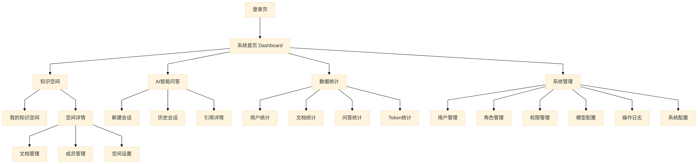
```mermaid
%%{init: {"theme":"base","themeVariables":{"fontFamily":"Microsoft YaHei, Arial, sans-serif"},"flowchart":{"curve":"linear","nodeSpacing":38,"rankSpacing":70,"padding":12,"useMaxWidth":false}}}%%
flowchart TD
    LOGIN["登录页"] --> HOME["系统首页 Dashboard"]

    HOME --> KB["知识空间"]
    HOME --> CHAT["AI智能问答"]
    HOME --> STAT["数据统计"]
    HOME --> SYS["系统管理"]

    KB --> KB1["我的知识空间"]
    KB --> KB2["空间详情"]
    KB2 --> KB3["文档管理"]
    KB2 --> KB4["成员管理"]
    KB2 --> KB5["空间设置"]

    CHAT --> C1["新建会话"]
    CHAT --> C2["历史会话"]
    CHAT --> C3["引用详情"]

    STAT --> S1["用户统计"]
    STAT --> S2["文档统计"]
    STAT --> S3["问答统计"]
    STAT --> S4["Token统计"]

    SYS --> M1["用户管理"]
    SYS --> M2["角色管理"]
    SYS --> M3["权限管理"]
    SYS --> M4["模型配置"]
    SYS --> M5["操作日志"]
    SYS --> M6["系统配置"]
```

---

# 二十五、权限模型

## 25.1 系统级 RBAC

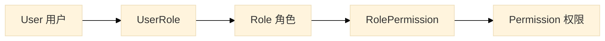
```mermaid
%%{init: {"theme":"base","themeVariables":{"fontFamily":"Microsoft YaHei, Arial, sans-serif"},"flowchart":{"curve":"linear","nodeSpacing":40,"rankSpacing":60,"padding":12,"useMaxWidth":false}}}%%
flowchart LR
    U["User 用户"] --> UR["UserRole"]
    UR --> R["Role 角色"]
    R --> RP["RolePermission"]
    RP --> P["Permission 权限"]
```

## 25.2 知识空间级权限

| 操作 | OWNER | ADMIN | EDITOR | READER |
|---|---:|---:|---:|---:|
| 查看知识空间 | ✓ | ✓ | ✓ | ✓ |
| AI问答 | ✓ | ✓ | ✓ | ✓ |
| 上传文档 | ✓ | ✓ | ✓ | × |
| 编辑文档 | ✓ | ✓ | ✓ | × |
| 删除文档 | ✓ | ✓ | × | × |
| 管理成员 | ✓ | ✓ | × | × |
| 删除知识空间 | ✓ | × | × | × |

---

# 二十六、文档状态机

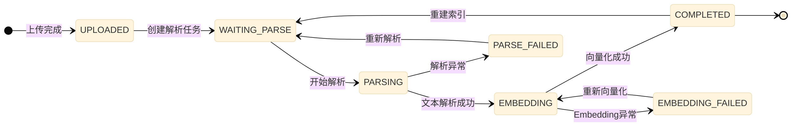
```mermaid
%%{init: {"theme":"base","themeVariables":{"fontFamily":"Microsoft YaHei, Arial, sans-serif"},"state":{"useMaxWidth":false}}}%%
stateDiagram-v2
    direction LR
    [*] --> UPLOADED : 上传完成
    UPLOADED --> WAITING_PARSE : 创建解析任务
    WAITING_PARSE --> PARSING : 开始解析

    PARSING --> EMBEDDING : 文本解析成功
    PARSING --> PARSE_FAILED : 解析异常

    EMBEDDING --> COMPLETED : 向量化成功
    EMBEDDING --> EMBEDDING_FAILED : Embedding异常

    PARSE_FAILED --> WAITING_PARSE : 重新解析
    EMBEDDING_FAILED --> EMBEDDING : 重新向量化

    COMPLETED --> WAITING_PARSE : 重建索引
    COMPLETED --> [*]
```

---

# 二十七、推荐后端工程结构

```text
ai-kb-server
├── common
│   ├── exception
│   ├── response
│   ├── utils
│   └── constants
├── security
│   ├── jwt
│   ├── filter
│   └── permission
├── modules
│   ├── user
│   ├── role
│   ├── permission
│   ├── space
│   ├── document
│   ├── conversation
│   ├── statistics
│   └── system
└── AiKbApplication
```

AI 服务：

```text
ai-service
├── api
│   ├── chat.py
│   ├── embedding.py
│   └── parser.py
├── rag
│   ├── retriever.py
│   ├── reranker.py
│   ├── prompt.py
│   └── pipeline.py
├── parser
│   ├── pdf.py
│   ├── word.py
│   └── markdown.py
├── embedding
├── llm
└── main.py
```

---

# 二十八、关键配置参数

```text
Embedding Model
LLM Model
Rerank Model

Chunk Size
Chunk Overlap
Retrieve Top-K
Rerank Top-K
Score Threshold
Temperature
Max Tokens
```

初始建议：

```text
Chunk Size      = 500 ~ 1000 tokens
Chunk Overlap   = 50 ~ 150 tokens
Retrieve Top-K  = 20
Rerank Top-K    = 5 ~ 8
Temperature     = 0.1 ~ 0.3
```

实际项目中应通过测试集进行调优。

---

# 二十九、异常处理

| 错误码 | 说明 |
|---|---|
| 10001 | 用户不存在 |
| 10002 | 密码错误 |
| 10003 | Token失效 |
| 20001 | 知识空间不存在 |
| 20002 | 无知识空间权限 |
| 30001 | 文件不存在 |
| 30002 | 文件格式不支持 |
| 30003 | 文档解析失败 |
| 40001 | AI服务不可用 |
| 40002 | Embedding失败 |
| 40003 | 向量检索失败 |
| 40004 | 模型调用失败 |

---

# 三十、安全设计

- JWT + Refresh Token
- Spring Security
- RBAC
- 空间级数据权限
- 文件 MIME / 扩展名 / 大小校验
- MinIO 私有 Bucket
- 接口参数校验
- SQL 注入防护
- XSS 防护
- 敏感日志脱敏
- AI 模型密钥加密保存
- RAG 检索前进行权限过滤
- 未授权 Chunk 不进入 Prompt

权限安全链：

```mermaid
%%{init: {"theme":"base","themeVariables":{"fontFamily":"Microsoft YaHei, Arial, sans-serif"},"flowchart":{"curve":"linear","nodeSpacing":35,"rankSpacing":55,"padding":12,"useMaxWidth":false}}}%%
flowchart LR
    U["当前用户"] --> P1["用户身份"]
    P1 --> P2["空间成员权限"]
    P2 --> P3["允许访问 Document"]
    P3 --> P4["允许检索 Chunk"]
    P4 --> P5["Vector / ES 检索"]
    P5 --> P6["RAG Context"]
    P6 --> LLM["LLM"]
```

---

# 三十一、非功能需求

## 性能目标

- 普通 API：P95 < 500 ms
- 知识检索：P95 < 2 s
- AI 首 Token：目标 2～5 s
- 支持 SSE 流式响应

## 可用性

- 系统目标可用性：99.5%+
- 服务异常应具备明确错误提示
- 文档处理支持失败重试

## 可扩展性

LLM、Embedding、Rerank 使用 Provider 抽象：

```text
LLMProvider
EmbeddingProvider
RerankProvider
```

便于后续接入 DeepSeek、Qwen、OpenAI、本地模型等。

---

# 三十二、验收标准

## 用户管理

- 可以完成登录认证
- 可以进行用户 CRUD
- 可以分配角色与权限

## 知识空间

- 可以创建和管理空间
- 可以添加成员
- 可以限制不同成员操作权限

## 文档管理

- 可以上传文档
- 可以自动解析
- 可以生成 Chunk
- 可以生成 Embedding
- 可以查询解析状态
- 可以重新构建知识索引

## 智能问答

- 可以选择知识空间
- 可以自然语言问答
- 可以连续多轮对话
- 可以流式输出
- 可以返回引用文档和引用片段

## 数据统计

- 用户统计
- 文档统计
- 知识空间统计
- AI问答统计
- Token消耗统计

---

# 三十三、系统完整业务闭环

```mermaid
%%{init: {"theme":"base","themeVariables":{"fontFamily":"Microsoft YaHei, Arial, sans-serif"},"flowchart":{"curve":"linear","nodeSpacing":50,"rankSpacing":70,"padding":14,"useMaxWidth":false}}}%%
flowchart LR
    subgraph ACCESS["访问入口"]
        direction LR
    U["用户"] --> AUTH["登录认证"]
    AUTH --> PERM["权限系统"]
    end

    subgraph INGEST["知识构建链路"]
        direction LR
    PERM --> KM["知识管理"]
    KM --> SPACE["知识空间"]
    SPACE --> DOC["文档上传"]
    DOC --> PARSE["文档解析"]
    PARSE --> CHUNK["Chunk切分"]
    CHUNK --> EMB["Embedding"]
    EMB --> VDB[("Vector DB")]
    end

    subgraph ASK["智能问答链路"]
        direction LR
    PERM --> QA["智能问答"]
    QA --> QUERY["用户问题"]
    QUERY --> QEMB["Query Embedding"]
    QEMB --> RET["Retrieval"]
    RET --> RR["Rerank"]
    RR --> CTX["Context"]
    CTX --> LLM["LLM"]
    QUERY --> LLM

    LLM --> ANSWER["AI回答"]
    ANSWER --> CITE["引用来源"]
    end

    VDB --> RET
    CITE --> FB["用户反馈"]
    FB --> STAT["数据统计"]
    STAT --> OPT["知识与模型持续优化"]
```

---

# 三十四、总结

AI智能知识库管理系统的核心并不是单纯“接入一个大模型”，而是建立完整的知识治理链路：

**用户与权限管理 → 知识空间 → 文档管理 → 文档解析 → Chunk → Embedding → 检索 → Rerank → RAG → LLM → 引用溯源 → 用户反馈 → 数据统计。**

业务层面实现：

**人 → 文档 → 知识 → 检索 → AI → 答案 → 数据反馈**

技术层面实现：

**RBAC + Document Pipeline + Hybrid Search + Vector Search + Rerank + RAG + LLM**

本方案包含：

- 业务需求分析
- 功能需求
- 角色权限
- 用例图
- WBS
- 甘特图
- 系统架构图
- 模块架构图
- 类图
- 活动图
- RAG流程图
- ER图
- 接口清单
- 登录时序图
- 文档处理时序图
- AI问答时序图
- 检索时序图
- 权限时序图
- 部署架构图
- 页面结构图
- 权限模型
- 状态机图
- 安全设计
- 非功能需求
- 验收标准
